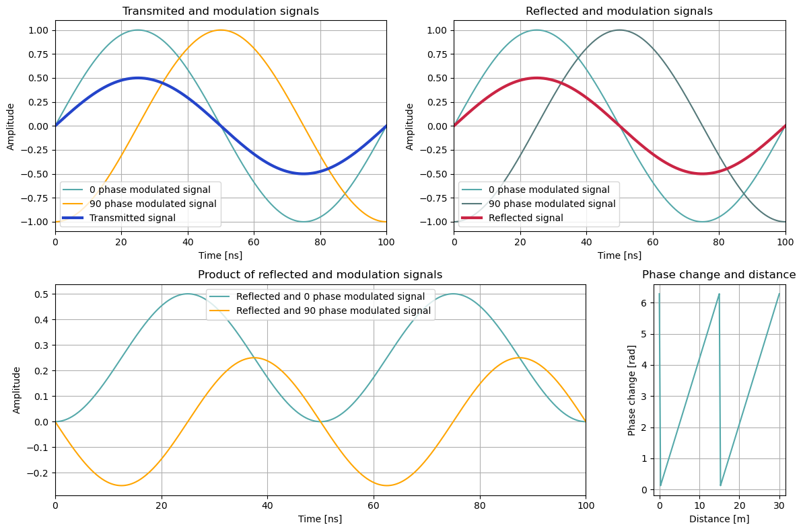
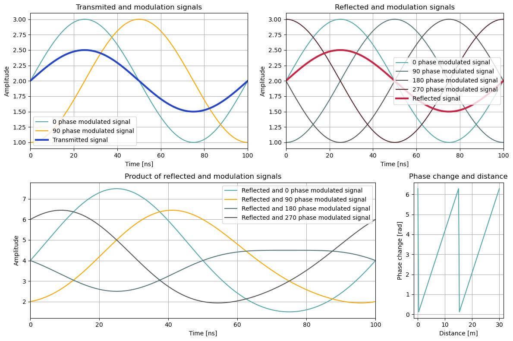

# 1. del

Odvisnost razdalje od fazne spremembe pri oddanem in modulirnem signalu z amplitudo v razponu ($\pm A$).

# 2. del

Ovisnost razdalje od fazne spremembe pri oddanem in modulirnem signalu v razponu pozitivnih vrednosti.
